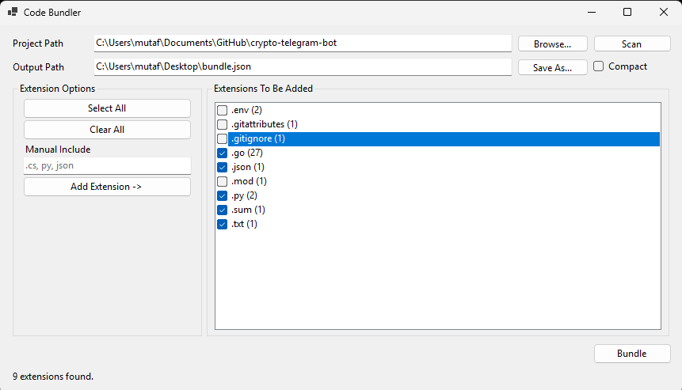

# Code Bundler

Collect code files with selected extensions into a single JSON file for AI project analysis. Built as a Windows Forms application with .NET.

## Why Use It?
AI tools are helpful when writing, reviewing, or debugging code, but larger projects are harder to share file by file.

This application scans a project folder, lists the detected file extensions, lets you choose which ones to include, and combines only the selected user code files into one JSON output. This makes it much easier to give an AI the relevant parts of a project in one step.

## Features
- Scan a project folder and detect available file extensions
- Select which extensions should be included
- Add custom extensions manually
- Ignore common system, package, cache, and dependency folders
- Export selected files into a single JSON file
- Provide file paths together with file contents for better AI context

## Benefits
- Save time by collecting code files automatically
- Give AI tools a cleaner and more complete project context
- Avoid including unnecessary dependency and system files
- Prepare project code for sharing, analysis, or review more easily
